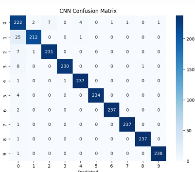

#  Smart-Digit-Recognizer

Variations in handwriting styles, sizes, and orientations make accurate recognition a non-trivial task.  
The goal of this challenge is to develop a model that can reliably identify digits (0–9) from handwritten samples.

---

##  CNN Confusion Matrix

  

---

## ⚙️ Performance

| Metric | Accuracy |
|:--------|:----------:|
|  Training Accuracy | **97.5%** |
| Validation Accuracy | **97.0%** |
|  Test Accuracy | **97.06%** |

The model demonstrates strong generalization across training, validation, and test sets, indicating effective learning and minimal overfitting.
